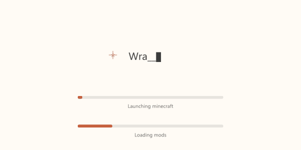
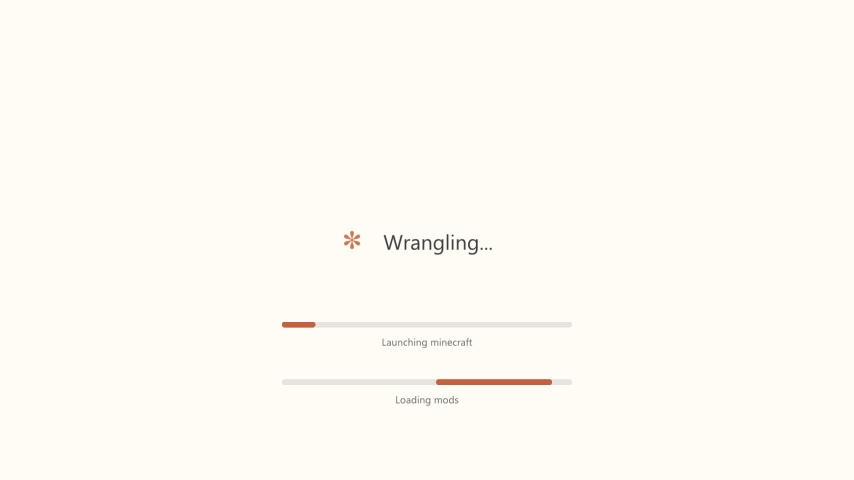
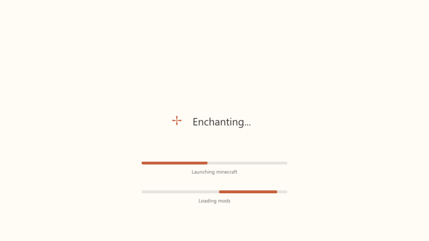
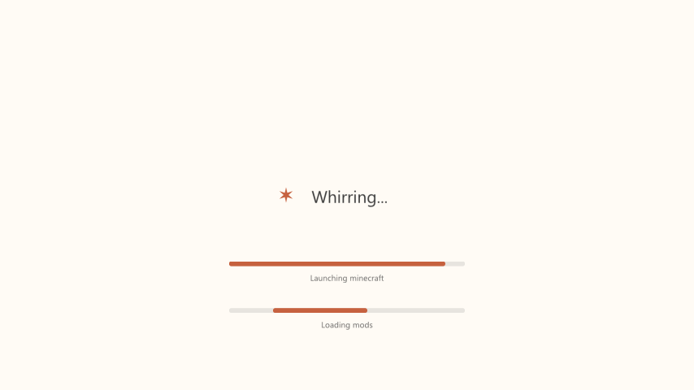
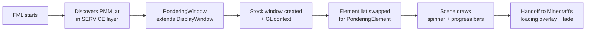

<div align="center">

# PMM — Pondering Minecraft Mods

**A calm, animated early loading screen for NeoForge 1.21.1.**<br>
Cycling verbs, a breathing glyph and your real mod-loading progress bars — instead of the red fox screen.




</div>

---

## Table of contents

- [Features](#features)
- [Preview](#preview)
- [Installation](#installation)
- [Uninstalling](#uninstalling)
- [How it works](#how-it-works)
- [Tech stack](#tech-stack)
- [Project layout](#project-layout)
- [Building from source](#building-from-source)
- [Troubleshooting](#troubleshooting)
- [Contributors](#contributors)
- [Credits & license](#credits--license)

## Features

- **Replaces the stock early window** (the red screen with the running fox) shown while Minecraft and NeoForge boot.
- **Animated glyph** — `· ✢ * ✶ ✻ ✽` and back, crossfaded smoothly between frames.
- **82 rotating verbs** ("Pondering…", "Noodling…", "Reticulating…") with a per-letter typing cascade (`▌` → `. _` → letter).
- **Real progress bars** — NeoForge's own loading meters (up to two), drawn as rounded bars with their labels.
- **Warm, quiet palette** — cream `#fffbf5` background, orange `#c6613f` accents, soft grey `#3b3b3b` text.
- **No music, no clock, no Mojang logo** — just the loading screen.
- **Fail-safe** — if anything goes wrong while setting it up, NeoForge's stock screen stays.
- **Zero extra dependencies** — it only uses libraries Minecraft already ships.

## Preview

<div align="center">

| Start | Mid-load | Almost done |
|:---:|:---:|:---:|
|  |  |  |

</div>

> Captures come from the included visual test harness (same renderer, rendered in a plain window).

## Installation

1. Download [`dist/PMM-1.0.jar`](dist/PMM-1.0.jar).
2. Drop it into your instance's `mods` folder.
3. Open `config/fml.toml` and set:

   ```toml
   earlyWindowProvider = "pondering"
   ```

4. Launch the game.

**Requirements**

| | |
|---|---|
| Minecraft | 1.21.1 |
| NeoForge | 21.1.x (tested with 21.1.252, FML 4.0.44) |
| Java | 21 (the one Minecraft 1.21.1 already uses) |
| OS | Windows 10/11 — fonts are read from `C:\Windows\Fonts` (`segoeui.ttf`, `seguisym.ttf`) |

## Uninstalling

Set `earlyWindowProvider = "fmlearlywindow"` in `config/fml.toml` and delete the jar from `mods`.
If you only delete the jar, NeoForge will find no provider named `pondering` and start without an early window — the game still launches.

## How it works



NeoForge's loading overlay insists on receiving a `DisplayWindow`, and most of that class's drawing pieces are package-private. So PMM **subclasses `DisplayWindow`**, keeps all window/context/handoff logic, and replaces only what is drawn:

1. The jar ships a `META-INF/services/…ImmediateWindowProvider` entry, so FML loads it in the **SERVICE layer** and picks it when `earlyWindowProvider = "pondering"`.
2. After the stock window initialises, a short-lived thread swaps the private `elements` list (reflection) for a single `PonderingElement`.
3. `RenderElement`'s constructor takes a non-public type, so the element is created with `Unsafe.allocateInstance` and only `render(...)` is used.
4. `Scene` renders everything with its own GLSL 150 shader — either text from a `stb_truetype` atlas or rounded rectangles via a signed-distance function.
5. `ColourScheme.RED/BLACK` are patched by reflection so the clear colour and the final fade use the cream background.
6. `Module.addReads` only lets a caller modify its own module, so `updateModuleReads` is re-implemented inside the mod instead of calling `super`.

## Tech stack

| Area | Technology |
|---|---|
| Language | Java 21 |
| Rendering | OpenGL 3.2 core via LWJGL 3.3.3 (GLFW, OpenGL) |
| Text | `stb_truetype` (LWJGL), 2×2 oversampled glyph atlas, Segoe UI + Segoe UI Symbol |
| Shading | GLSL 150, SDF rounded rectangles |
| Integration | NeoForge FML 4.0.x early-window SPI (`ImmediateWindowProvider`) |
| Packaging | Plain `javac` + `jar` (`build.sh`), automatic module `pondering_loading` |

## Project layout

```text
src/pondering/loading/
├── PonderingWindow.java    # ImmediateWindowProvider (extends DisplayWindow)
├── PonderingElement.java   # the single RenderElement that delegates to Scene
├── Scene.java              # all drawing: glyph, verbs, typing cascade, progress bars
└── Trace.java              # optional disk trace for debugging
resources/META-INF/services # provider registration
test/Harness.java           # renders the Scene in a plain window and saves PNGs
dist/PMM-1.0.jar            # prebuilt mod
docs/                       # GIF and screenshots
```

## Building from source

```bash
./build.sh        # produces build/PMM-1.0.jar
```

`build.sh` compiles against the libraries bundled with [Prism Launcher](https://prismlauncher.org/) (override the location with `PRISM_LIBS`). It needs a JDK 21 on `PATH`.

To preview the screen without launching Minecraft, compile and run `test/Harness.java` (needs the LWJGL natives on the classpath); pass `gif` as the second argument to dump an animation's frames.

## Troubleshooting

| Symptom | Fix |
|---|---|
| The stock red screen appears | PMM failed to set up; check `logs/latest.log` for `PONDERING` lines and `logs/pondering-trace.log` |
| No early window at all | `earlyWindowProvider` is `"pondering"` but the jar is missing from `mods` |
| Game exits right after "Launching target" | The error is written to `logs/pondering-trace.log` — open an issue with its stack trace |
| Need step-by-step diagnostics | Add `-Dpondering.trace=true` to the JVM arguments |

## Contributors

| | |
|---|---|
| **[Muurrcc](https://github.com/Muurrcc)** | Author, design direction, testing |
| **Claude** (Anthropic) | Co-author: reverse-engineering of the NeoForge early window, renderer and mod implementation (credited via `Co-Authored-By` on the commits) |

## Credits & license

Style inspired by the "thinking" spinner of AI coding assistants. PMM is an independent project and is not affiliated with Mojang, NeoForged or Anthropic.

Released under the [MIT License](LICENSE).
